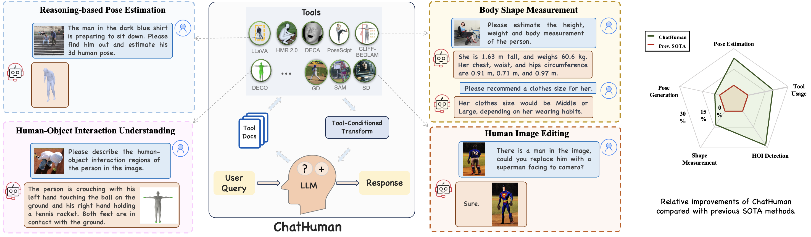

# **ChatHuman: Chatting about 3D Humans with Tools**

<p align="center">
  <a href='https://arxiv.org/abs/2405.04533'>
    
  </a>
  <a href='https://arxiv.org/pdf/2405.04533'>
    
  </a>
  <a href='https://chathuman.github.io'>
  
  </a>
  <a href='https://youtu.be/0a0ZYJgzdWE'>
  
  </a>
  <a href='https://github.com/linjing7/ChatHuman'>
    
  </a>
  <a href="" target='_blank'>
    
  </a>
</p>

This repository contains the implementation of the following paper:

> ChatHuman: Language-driven 3D Human Understanding with Retrieval-Augmented Tool Reasoning
> 
> [Jing Lin](https://jinglin7.github.io/)<sup>3,4,\*</sup>, [Yao Feng](https://scholar.google.com/citations?user=wNQQhSIAAAAJ&hl=en)<sup>2,3,\*</sup>, [Weiyang Liu](https://wyliu.com/)<sup>1,5</sup>,[Michael J. Black](https://ps.is.mpg.de/person/black)<sup>1</sup>
>
> <sup>1</sup>Max Planck Institute for Intelligent Systems, <sup>2</sup>Standford University, <sup>3</sup>Meshcapade, <sup>4</sup>Tsinghua University, <sup>5</sup>University of Cambridge, <sup>*</sup>Equal Contribution



## 🤝 Citation  

If you find this repository useful for your work, please consider citing it as follows:

```  
@InProceedings{lin2025chathuman,
        title={{ChatHuman}: Chatting about 3D Humans with Tools},
        author={Lin, Jing and Feng, Yao and Liu, Weiyang and Black, Michael J.},
        year={2025},
        booktitle = {CVPR},
  }
```
